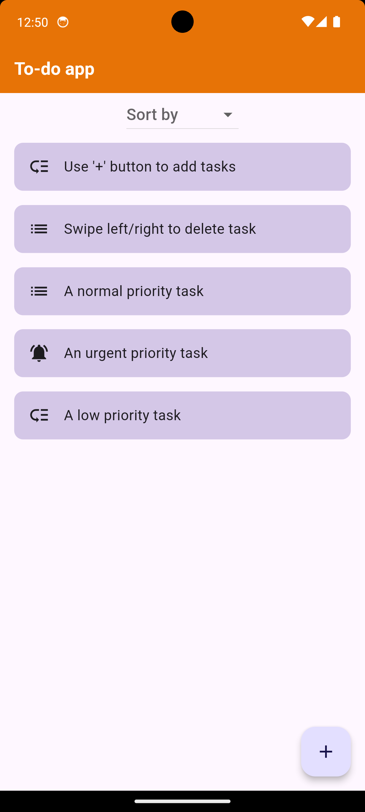
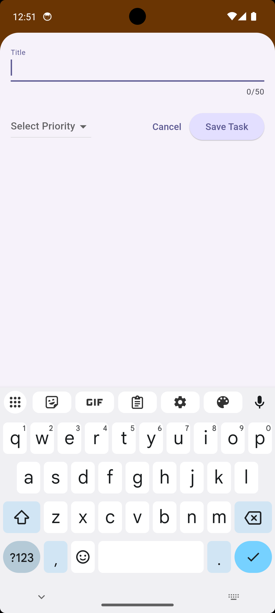
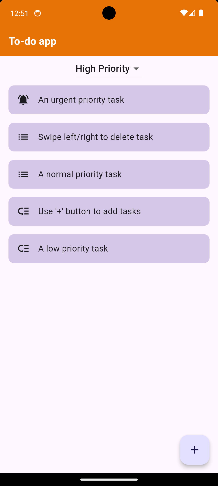

# To-do app

## Table of Contents
- [Introduction](#introduction)
- [Features](#features)
- [Technologies Used](#technologies-used)
- [Setup Instructions](#setup-instructions)
- [Usage](#usage)
- [Database Schema](#database-schema)
- [Screenshots](#screenshots)
- [Contributing](#contributing)
- [Contact](#contact)

## Introduction
A new simple Flutter project that can add tasks by taking them from users along with their priority. It can then sort and display them in lexicographically ascending, descending or priority based order.

## Features
- **Add tasks:** Allows users to add tasks using modal bottom sheet.
- **Delete tasks:** Allows users to delete tasks by swiping the task cards left/right.
- **Sorting tasks:** Allows for lexicographical ascending, descending sorting. Also can sort tasks based on priority showcasing high or low priority tasks first.
- **Input Validation:** Ensures valid inputs are given.

## Technologies Used
- **Flutter:** Framework and it's various packages.
- **Dart:** Primary programming language.

## Setup Instructions
1. **Install Flutter and Android Studio:**
    
    Make sure you have the necessary requirements to run a Flutter app in your local machine. Flutter framework, it's extensions in VS Code, Android Studio, android emulator (from Android Studio) to run your apps and see them how they look on screens (Alternatively you can run apps on your actual mobile devices too).

2. **Clone the repository:**
   Type following commands in your terminal after you have directed in a particular directory.
   
   - git clone https://github.com/amaanshaikh2114/To_do_app.git
    

## Usage
1. **Run the application:**
    Go to the directory where you have placed the project and type 'flutter run' in the terminal. Ensure flutter is recognised by your system by making sure it's in the 'Path' option of System variables by going to the environment variables of your system.
    

2. **Add task:**
    Use the floating action button '+' at the bottom to open modal bottom sheet and enter title and choose priority of task from the drop down menu.

3. **Delete task:**
    Delete the task by swiping the task card left/right.

4. **Sort on different basis:**
    Choose the option from the drop down menu on teh top on the home page to sort the tasks accordingly 

## Screenshots

## Contributing
Contributions are welcome! If you have any ideas, suggestions, or bug reports, please open an issue or submit a pull request.

## Contact
For any questions or inquiries, please contact [Amaan Shaikh](mailto:amaanmazhar211@gmail.com). Send a mail to amaanmazhar211@gmail.com
